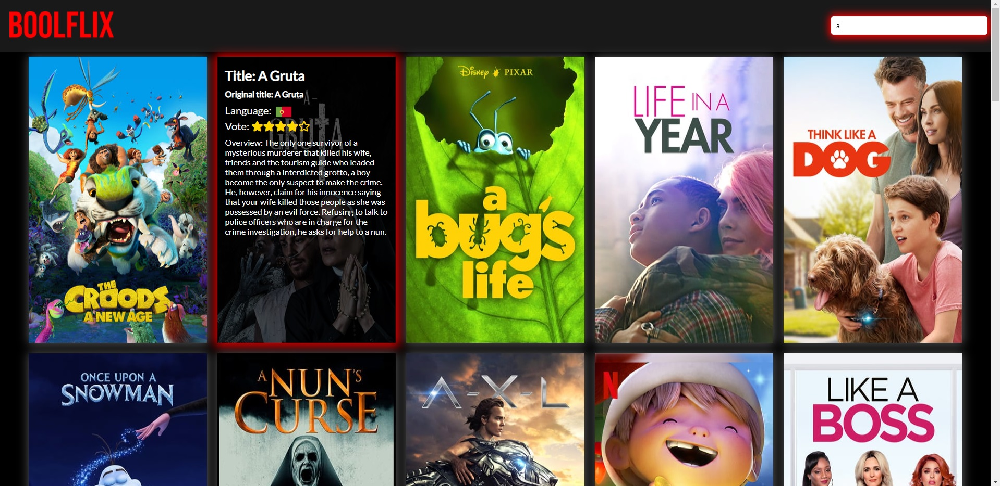

<h1>Boolflix</h1>
Creazione di web app responsive per la visualizzazione di una libreria di film e serie tv. Il progetto è stato gestito tramite chiamate AJAX al database di TMDB. 
Tecnologie utilizzate: HTML, CSS, JavaScript con Vue.js. 
Funzionalità:
<ul>
  <li>Ricerca film e serie tv con risultati in tempo reale durante la digitazione</li>
  <li>Informazioni dei vari elementi visualizzate su hover</li>
 </ul>
 

